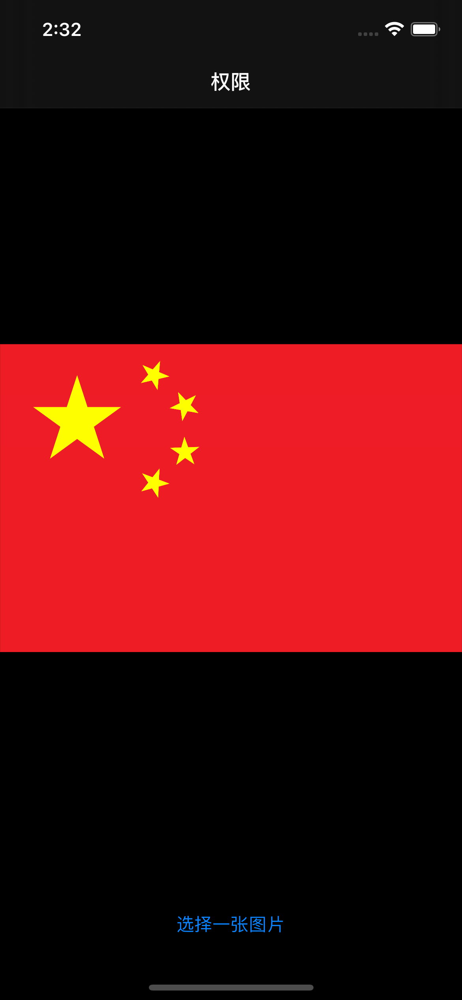
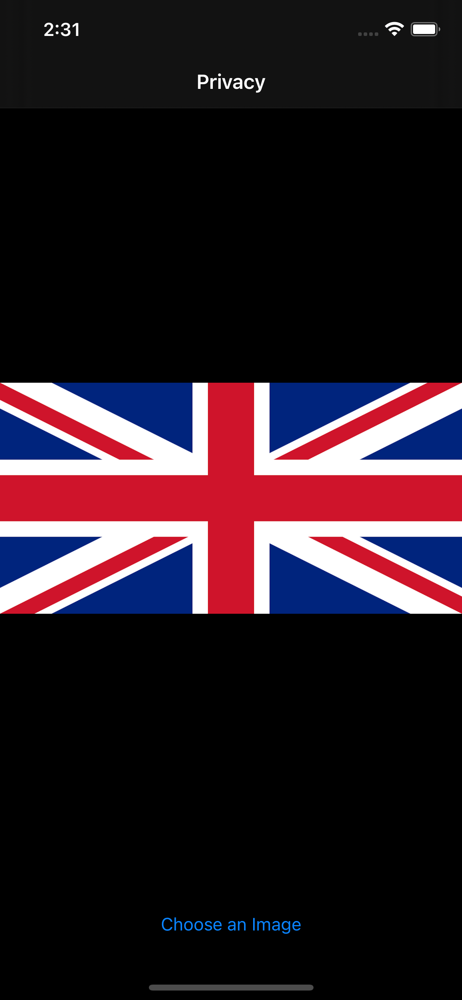
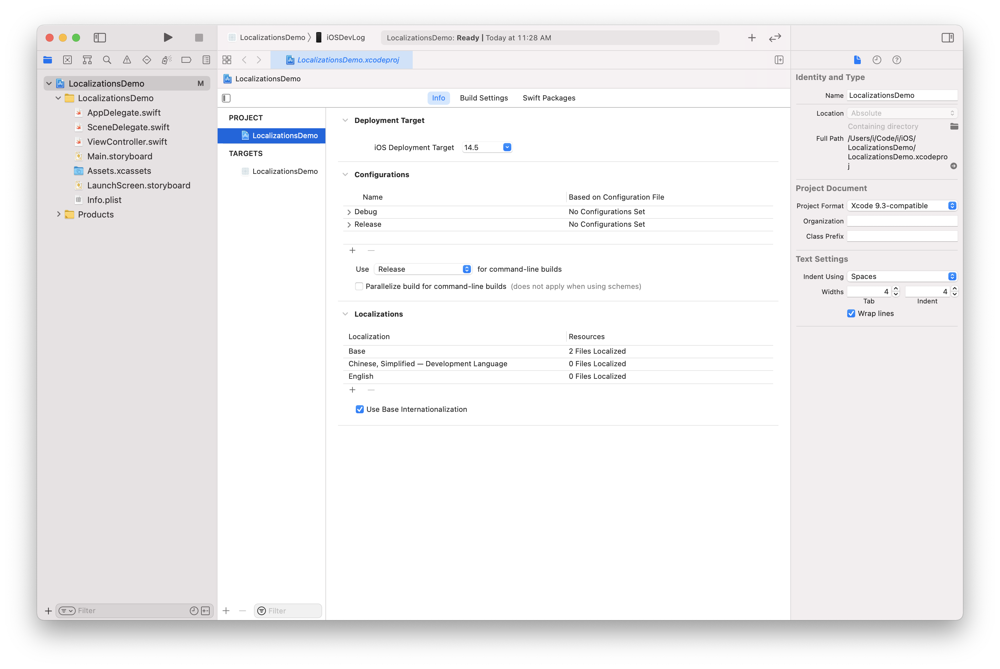
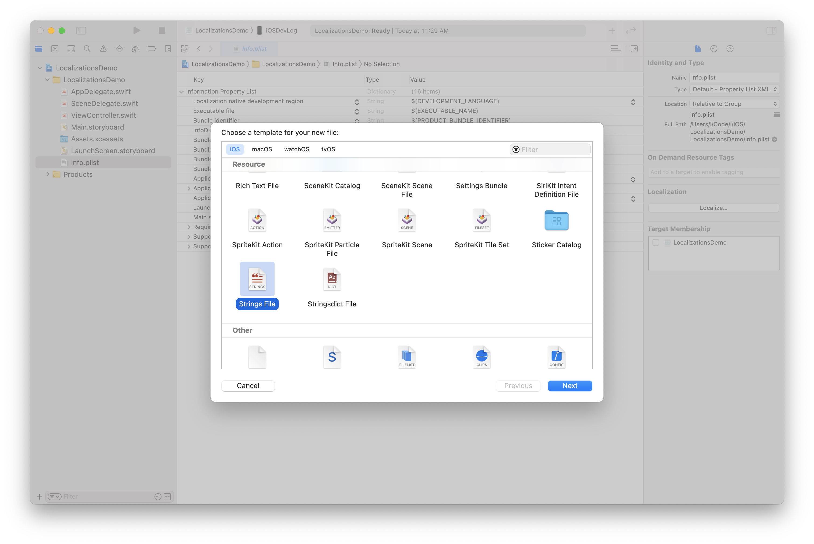
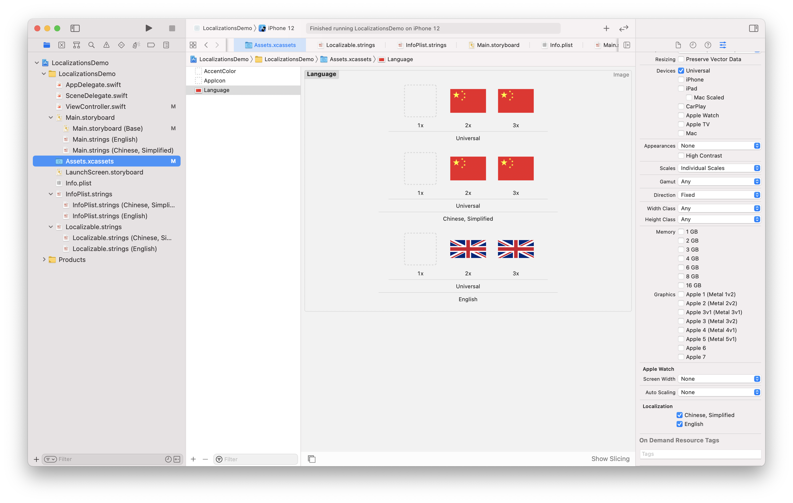

# Localizations Demo
---

## Screenshots




## Development Language

```diff
diff --git a/LocalizationsDemo.xcodeproj/project.pbxproj b/LocalizationsDemo.xcodeproj/project.pbxproj
index 99a0866..644281e 100644
--- a/LocalizationsDemo.xcodeproj/project.pbxproj
+++ b/LocalizationsDemo.xcodeproj/project.pbxproj
@@ -103,7 +103,7 @@
                        };
                        buildConfigurationList = 08AC24BB268D6D3800425EEC /* Build configuration list for PBXProject "LocalizationsDemo" */;
                        compatibilityVersion = "Xcode 9.3";
-                       developmentRegion = en;
+                       developmentRegion = zh-Hans;
                        hasScannedForEncodings = 0;
                        knownRegions = (
                                en,
```



## App Name

`InfoPlist.strings`



```c
"CFBundleName" = "本地化";
```

## String

`Localizable.strings`

```c
"选好了" = "Done";
```

## Image


